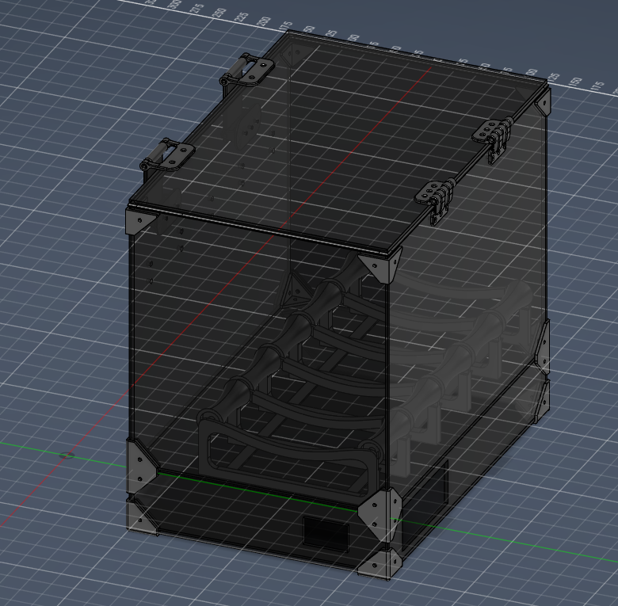
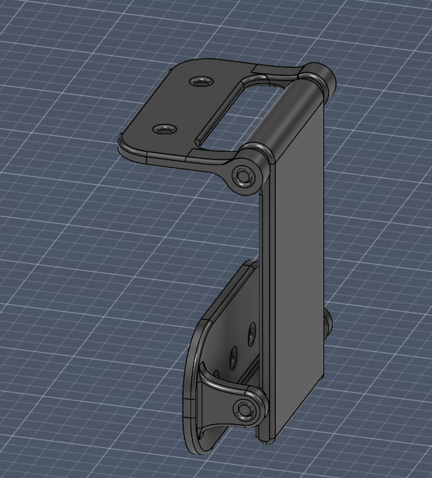
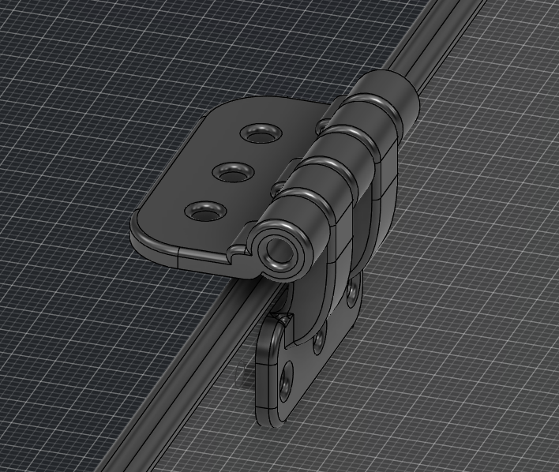

# 5-Spool Heated Drybox & AMS-Ready Controller

This project features an **Active Heated Drybox** designed for 5 filament spools, managed by a **BigTreeTech SKR 3** 3D printer motherboard. The system ensures filaments remain dehumidified and print-ready, with a hardware foundation prepared for future AMS (Automatic Material System) expansion.

---

## Technical Specifications
* **Controller:** BigTreeTech SKR 3 (Marlin 2.1.x Firmware).
* **Capacity:** 5 standard spools (up to 200mm diameter).
* **Heating:** 24V PTC Heater with a 5015 Blower Fan for active air circulation.
* **Interface:** LCD 12864 Graphic Display with rotary encoder.
* **Sensor:** Trianglelab NTC 100K B3950 Thermistor (M3 Threaded version).
* **External Electronics:** Housed in a dedicated ventilated base to prevent overheating of the MCU and PSU.

---


# Repository Structure
* `/CAD`: 3D models (STL/STEP) for the enclosure corners, electronics base, and internal spool rollers.
* `/Firmware`: Pre-configured Marlin source code and compiled `firmware.bin`.

| Component | Quantity | Total Price USD | Supplier |
| :--- | :---: | :---: | :--- |
| Screen with controller | 1 | 17,42 | Aliexpress |
| M3 20mm Standoff | 4 | 5,15 | Aliexpress |
| Rubber Hose 2mm | 3m | 4,26 | Aliexpress |
| 608RS Bearings | 20 | 11,53 | Aliexpress |
| Nema 17 Motors | 5 | 50,3 | Aliexpress |
| 24V/20A Power Supply | 1 | 41,95 | Aliexpress |
| SKR3 control board + drivers | 1 | 77,29 | Aliexpress |
| 24V/250W PTC heater | 1 | 9,35 | Aliexpress |
| PTFE Tube Connector | 10 | 6,76 | Aliexpress |
| power plug | 1 | 2,31 | Aliexpress |
| B3950 heat sensor | 2 | 16,1 | Aliexpress |
| 4010 fan | 3 | 8,91 | Aliexpress |
| 505020 fan | 2 | 9,72 | Aliexpress |
| dual drive extruder | 5 | 43,9 | Aliexpress |
| PC Panels | custom | 81,09 | PannelliPlastica |
| **Total price:** | | **386,04** | |
| **Total price+shipping** | | **395,44** | |

> All the screws, heat press inserts and nuts I will buy them by myself to stay under 400 USD

---
## Images
FullAssembly

Latches

Hinges


## Firmware Configuration (Marlin)
The system utilizes a specialized build of Marlin. Key modifications in `Configuration.h` include reassigning the Heated Bed output to drive the Chamber Heater:

```cpp
// Core settings for the Drybox
#define MOTHERBOARD BOARD_BTT_SKR_V3_0
#define TEMP_SENSOR_CHAMBER 1        // NTC 100K B3950
#define HEATER_CHAMBER_PIN HEATER_BED_PIN 

// Display Settings
#define REPRAP_DISCOUNT_FULL_GRAPHIC_SMART_CONTROLLER